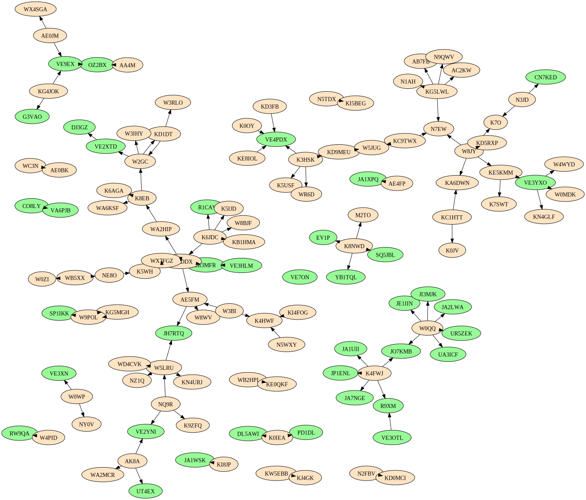

# ft8-network
Network analysis of traffic recorded by wiki-plugin-wsjt

Run the watch script to visualize ham radio conversations as they happen.
The hot script selects stations to be rendered in a distict color in the diagrams.
We start by identifying DX stations.

